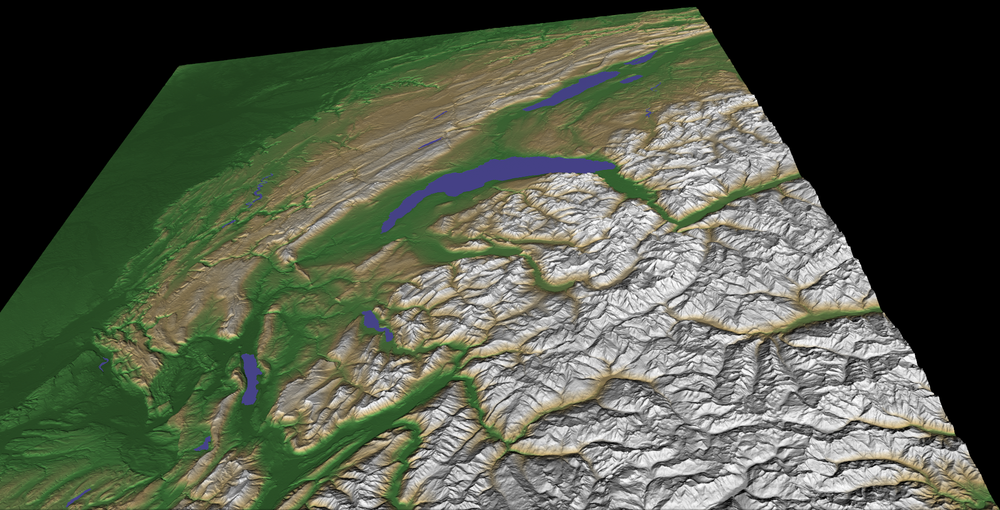

# VTK - Labo 2

- Gildas Houlmann
- Thibaud Franchetti

## Installation

```
pip install -r requirements.txt
```

## Usage

Pour générer un fichier de données :

```
python parse.py
```

Pour visualiser le fichier généré :

```
python labo2.py
```

Pour représenter la montée des eaux due au réchaufemment climatique, changer la constante `SEA_LEVEL` dans le fichier `constants.py` et regénérer un fichier de données avec :

```
python parse.py
```

## Résulats

### Vue standard



### Niveau de la mer à 370m

